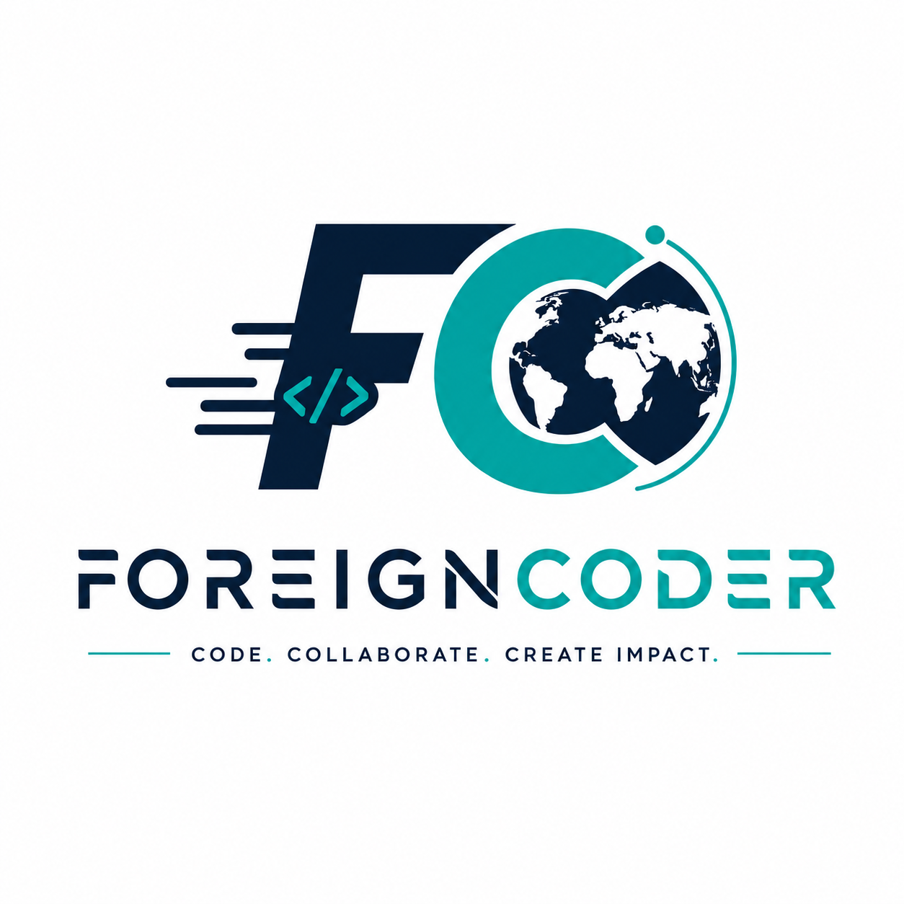

<div align="center">
  
  <h1>ForeignCoder</h1>
  <p><b>An international student engineering squad bridging borders through code.</b></p>

  <!-- Badges -->
  <p>
    
    
    
    
    
  </p>

  <p>
    <a href="#about-the-squad">About</a> •
    <a href="#meet-the-team">Meet the Team</a> •
    <a href="#key-features">Key Features</a> •
    <a href="#project-structure">Project Structure</a> •
    <a href="#getting-started">Getting Started</a> •
    <a href="#contact--connect">Contact</a>
  </p>
</div>

---

## 🌐 About The Squad

**ForeignCoder** is a cross-border, 6-member student engineering squad collaborating across **Bangladesh** and **Africa**. We combine varied perspectives and domain expertise—spanning leadership, strategy, UI/UX design, quality assurance, and technical storytelling—to deliver high-impact, beautifully engineered software solutions.

### Our Core Pillars
- 🚀 **Technical Excellence**: Clean, semantic HTML5, modern vanilla CSS3 design systems, and modular JavaScript.
- 🌍 **Global Collaboration**: Seamless remote engineering bridging diverse time zones and cultures.
- 🎨 **Visual Prestige**: Curated typography, harmonious color palettes (`#081C3A` Navy and `#10CFC9` Teal), and responsive layouts that wow at first glance.
- 🛡️ **Zero-Defect Quality**: Rigorous testing strategies and meticulous attention to detail.

---

## 👥 Meet the Team

| Profile | Name | Role | Enrollment No. & Div | Location | GitHub | Contact |
| :---: | :--- | :--- | :---: | :---: | :---: | :--- |
|  | **Shuvo Das** | 👑 Team Leader | `2403051051377`<br>Div **5A15** | Bangladesh | [@engrshuvodas](https://github.com/engrshuvodas) | [engrshuvoda@gmail.com](mailto:engrshuvoda@gmail.com) |
|  | **Vitumbiko Ziba** | 📢 Communications & Presentation | `2403051051378`<br>Div **5A15** | Africa | [@vituzi](https://github.com/vituzi) | [vituglory@gmail.com](mailto:vituglory@gmail.com) |
|  | **Bipu Roy** | 💡 Strategy & Ideation | `2403051051363`<br>Div **5A13** | Bangladesh | [@BipuRoy](https://github.com/BipuRoy) | [bipur8910@gmail.com](mailto:bipur8910@gmail.com) |
|  | **Setu Mondal** | 🧪 Quality Assurance Tester | `2403051051376`<br>Div **5A15** | Bangladesh | [@setucloud](https://github.com/setucloud) | [setumondal32@gmail.com](mailto:setumondal32@gmail.com) |
|  | **Sajib Biswas** | 🎨 UI/UX Designer | `2403051240220`<br>Div **5B3** | Bangladesh | [@mrsajib07](https://github.com/mrsajib07) | [bsajib116@gmail.com](mailto:bsajib116@gmail.com) |
|  | **Monami Sadhu** | 📝 Documentation & Presentation | `2403051051375`<br>Div **5A15** | Bangladesh | [@monami2005](https://github.com/monami2005) | [monamisadhu67@gmail.com](mailto:monamisadhu67@gmail.com) |

---

## ✨ Key Features

### 1. **Modern & Premium Design Aesthetics**
- **Curated Color System**: Uses sleek light mode backgrounds (`#F8FAFC`) paired with deep navy (`#081C3A`) and vibrant teal accents (`#10CFC9`).
- **Typography**: Powered by Google Fonts (**Space Grotesk** for bold, modern headings and **Inter** for clean, readable body text).
- **Glassmorphism & Gradients**: Subtle translucent topbars with backdrop filters and smooth gradient borders.

### 2. **Fully Responsive Architecture**
- Seamlessly scales across every breakpoint—from small mobile devices (`320px`) to tablets (`768px`) and wide desktops (`1280px+`).
- Mobile-optimized navigation with an interactive slide-in drawer menu.

### 3. **Interactive & Dynamic Elements**
- **Scroll Reveal Transitions**: Elements smoothly fade and slide into view on scroll.
- **Dynamic Team Cards**: Multi-zone card layout with hover halos, location chips, icon-badged information rows, and direct GitHub links.
- **Coming Soon Experience**: Integrated countdown timer to upcoming project launches with persistent email waitlist notification capture (`localStorage`).

### 4. **Direct WhatsApp Integration**
- Interactive **Contact Us** buttons that open direct conversations on **WhatsApp Mobile** and **WhatsApp Web** with a pre-filled, URL-encoded greeting message.

---

## 📂 Project Structure

```text
ForeignCoder/
├── index.html               # Main squad showcase & team directory page
├── coming-soon.html         # Projects preview page with countdown timer & email capture
├── animation teamview/      # Interactive Amber Aviation-inspired team showcase (1.5s auto-slide)
│   ├── index.html           # Animated slide presentation view
│   ├── style.css            # Frosted glass bottom bar & responsive layout styling
│   └── script.js            # Automatic 1.5-second slide timer & real project data
├── css/
│   └── main.css             # Global design tokens, resets, and utility classes
├── img/
│   ├── logo/
│   │   └── foreigncoder-logo.png # Official ForeignCoder primary logo & favicon
│   ├── team/                # High-resolution team member avatars
│   └── bg/                  # Background visuals and banners
├── LICENSE                  # Project licensing
└── README.md                # Project documentation
```

---

## 🚀 Getting Started

To view or work on this project locally, no external build tools or bundlers are required.

### Prerequisites
- Any modern web browser (Google Chrome, Firefox, Safari, Microsoft Edge).
- Optional: A local development server (e.g., [VS Code Live Server](https://marketplace.visualstudio.com/items?itemName=ritwickdey.LiveServer) or Node `npx serve`).

### Installation & Execution

1. **Clone the Repository**:
   ```bash
   git clone https://github.com/engrshuvodas/ForeignCoder.git
   cd ForeignCoder
   ```

2. **Run Locally**:
   - Simply open `index.html` directly in your browser, or
   - Start a local HTTP server:
     ```bash
     # Using Python 3
     python -m http.server 8000

     # Using Node.js
     npx serve .
     ```
   - Navigate to `http://localhost:8000` in your web browser.

---

## 💬 Contact & Connect

We are always excited to discuss new opportunities, collaborations, and projects!

- **WhatsApp Direct**: [Connect with us on WhatsApp (+91 96417 00503)](https://wa.me/919641700503?text=Hello%2C%20I%20hope%20you%27re%20doing%20well.%20I%20would%20like%20to%20learn%20more%20about%20your%20project%20and%20your%20team.%20I%20found%20your%20contact%20information%20through%20the%20ForeignCoder%20website%20and%20would%20appreciate%20the%20opportunity%20to%20connect.%20Thank%20you.)
- **Primary Email**: [engrshuvoda@gmail.com](mailto:engrshuvoda@gmail.com)
- **GitHub**: [engrshuvodas/ForeignCoder](https://github.com/engrshuvodas/ForeignCoder)

---

<div align="center">
  <p>© 2026 <b>ForeignCoder</b>. Built with ❤️ by an international student squad.</p>
</div>
